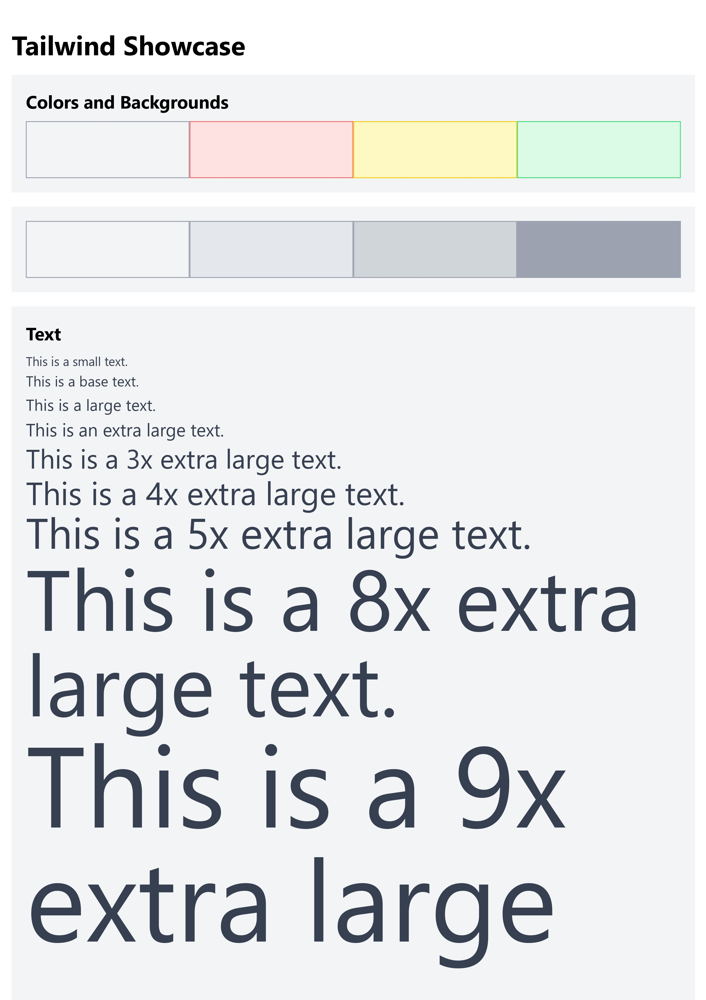
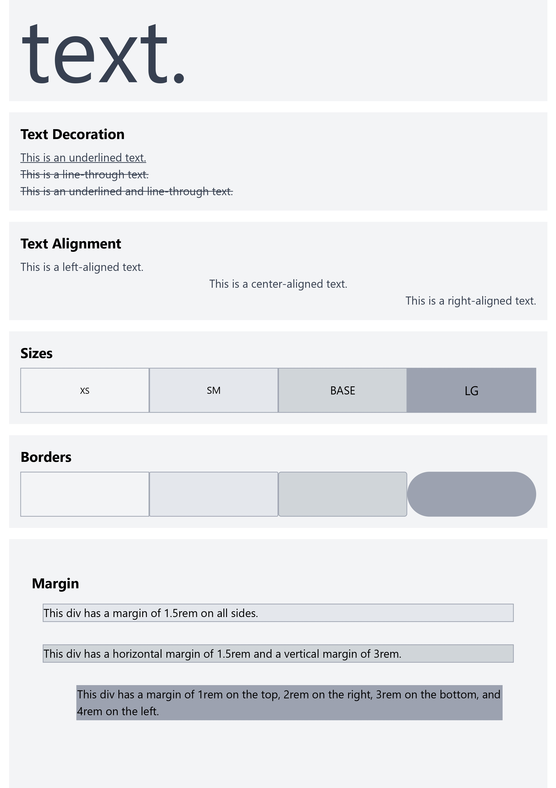
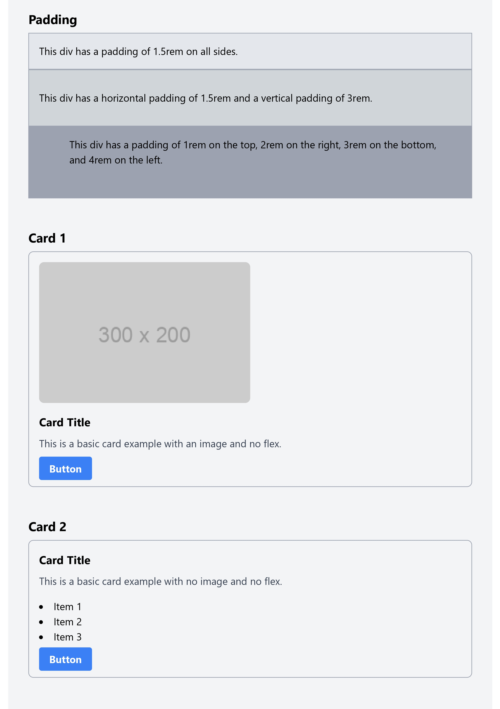

# Basic Styling with Tailwind

## Objective:

- Use Tailwind CSS to reproduce the styling of the given model.

## Instructions:

1. You have an HTML file under public with a basic structure and no styles applied.

To run your project you need to run the following commands:

```bash
npm install
npm run dev
```

This will first install necessary dependencies and then run the project and check for changes in your code. If you open your live server you'll see that youre Tailwind Changes apply.

2. You can find a PDF file `Tailwind Showcase.pdf` with a model image that shows the final result you need to achieve. You'll find it under `assets` folder.

3. Open the Tailwind CSS documentation for reference: [Tailwind CSS Documentation](https://tailwindcss.com/docs)
   - Use the documentation to find the appropriate utility classes for styling elements such as text, background, padding, margin, and more.
   - With the "Quick Search" you'll be able to find what you need very quickly.

The PDF looks like this:








